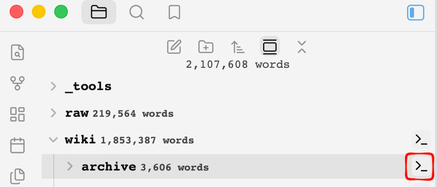
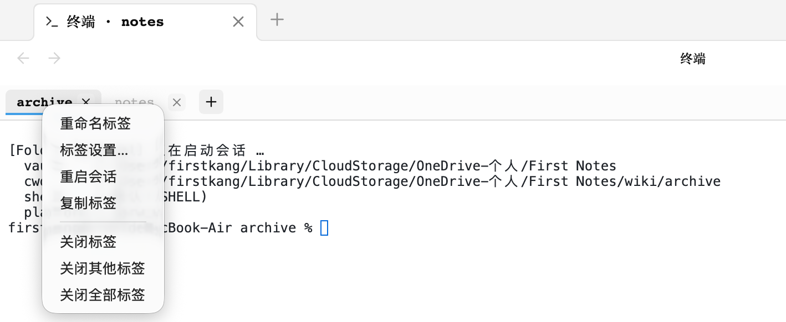
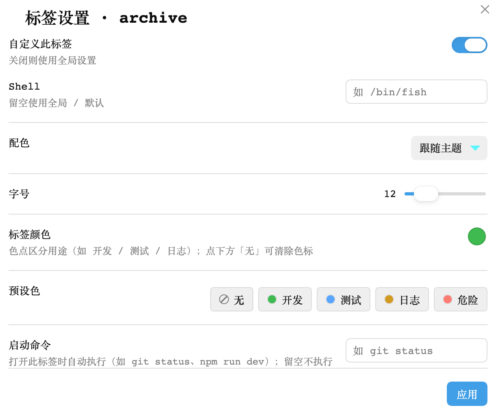

# Folder Terminal

> This README is bilingual: **English** sections first, **中文** sections below.
> 本说明为双语：英文在前，中文在后。

**Folder Terminal** is an Obsidian plugin that adds a terminal icon to every folder in the file explorer. Hover over a folder and click the icon to open a **real shell (PTY)** at the bottom of Obsidian, with the working directory automatically set to that folder.

> ⚠️ Desktop-only (depends on Node's `child_process`); not available on mobile.

**Highlights**

- Hover-to-reveal terminal icon on folders (auto-hidden while renaming)
- Real PTY via an embedded Python proxy — `vim` / `ssh` / `htop` work normally, no native modules required
- Multi-tab sessions, drag-to-reorder, double-click rename, per-tab settings (shell / color scheme / font size / **color tag**)
- Cross-restart recovery, theme-aware GitHub-style colors, clickable URLs
- UI localization: Chinese / English / **Follow system**

**Platform notes**: macOS requires `python3` (Xcode Command Line Tools); Linux falls back to `script` when `python3` is missing; Windows uses winpty when available, otherwise `cmd.exe`.

---

Obsidian 插件：鼠标移到文件浏览器中的**文件夹**上时，标题右侧出现「终端」图标；点击后在 Obsidian 当前面板**下方**打开一个真实 Shell（PTY）窗口，工作目录自动切换为该文件夹。

> ⚠️ **仅支持桌面端**（依赖 Node 的 `child_process`），移动端不可用。

## Features / 功能

### English

- 🖱️ **Hover-to-reveal icon** on every folder title (floats at the right edge, no layout shift, auto-hidden while renaming)
- 📂 **One-click `cd`** — opens a terminal already rooted at that folder's absolute path (including the vault root)
- 🗂️ **Multi-tab sessions** — one tab per folder, each an independent shell; switching tabs keeps scrollback, closing a tab ends the session
- 🧲 **Drag-to-reorder** tabs
- ✏️ **Double-click rename** a tab (does not rename the actual folder)
- 🖱️ **Right-click menu** — rename / tab settings / restart session / close
- 🎛️ **Per-tab settings** — override shell, color scheme, font size, color tag (persisted with the workspace layout)
- 💾 **Cross-restart recovery** — the tab list is persisted with the workspace layout and restored on next launch
- 🖥️ **Real PTY** — on macOS / Linux an embedded **Python PTY proxy** (`pty.fork`) creates a true pseudo-terminal, so interactive programs like `vim` / `ssh` / `htop` work without any native modules
- 📐 **Live resize** — `TIOCSWINSZ` keeps the PTY size in sync with the panel, so full-screen TUIs react instantly
- ⚙️ **Settings** — default shell, font size, color scheme (theme / dark / light), panel-reuse toggle
- 🔗 **Clickable URLs** (xterm web-links)
- 🎨 **Theme-aware** GitHub-style colors

### 中文

- 🖱️ 文件夹悬浮图标：鼠标移入文件夹标题显示终端图标（右端悬浮，不占位不误触；重命名时自动隐藏）
- 📂 一键进入目录：点击图标，终端自动 `cd` 到该文件夹的**磁盘绝对路径**（含库根目录，`data-path=""`）
- 🗂️ **多标签会话**：每个文件夹一个标签页，各自独立 Shell；切换标签不丢滚动历史，关闭标签才结束会话
- 🧲 **标签拖拽排序**：直接拖动标签调整顺序
- ✏️ **双击重命名**：自定义标签名（不影响实际文件夹名）
- 🖱️ **右键菜单**：重命名 / 标签设置 / 重启会话 / 关闭标签
- 🎛️ **每标签独立设置**：可单独覆盖 Shell、配色、字号、颜色标记（弹窗配置，随布局持久化）
- 💾 **跨重启恢复**：标签列表随工作区布局持久化，重启 Obsidian 后自动恢复所有会话
- 🖥️ 真实 PTY：macOS / Linux 通过内嵌的 **Python PTY 代理**（`pty.fork`）创建真实伪终端，**vim / ssh / htop 等交互程序可正常工作**，无需任何原生模块
- 📐 自适应尺寸：面板大小变化时通过 `TIOCSWINSZ` 实时调整 PTY 尺寸，**vim 内全屏程序也能即时感知**
- ⚙️ 设置面板：默认 Shell、字号、配色方案（跟随主题/深色/浅色）、面板复用开关
- 🔗 链接可点：URL 自动高亮可点击（xterm web-links）
- 🎨 跟随主题：明暗主题下采用 GitHub 风格配色

## Screenshots / 截图

**Hover icon** — 鼠标悬停文件夹时显示终端图标



**Multi-tab terminal** — 多标签终端与右键菜单



**Per-tab settings** — 标签设置弹窗



## Installation / 安装

### English

**Option A — Community plugin browser (after this plugin is approved)**

1. Open **Settings → Community plugins**
2. Turn off *Restricted mode* if prompted
3. Click **Browse**, search for **Folder Terminal**, then **Install** and **Enable**

**Option B — BRAT (for beta / pre-release testing)**

1. Install the **BRAT** plugin from the community browser
2. Open the command palette and run **BRAT: Add a beta plugin for testing**
3. Paste `https://github.com/FIRSTKANG/folder-terminal` and confirm
4. Enable **Folder Terminal** in Community plugins

**Option C — Manual**

1. Build: `npm install && npm run build`
2. Copy the plugin folder (containing `main.js`, `manifest.json`, `styles.css`) into your vault's `.obsidian/plugins/folder-terminal/`
3. Enable **Folder Terminal** in **Settings → Community plugins**

### 中文

**方式 A — 社区插件市场（插件过审后可用）**

1. 打开 **设置 → 第三方插件**
2. 按提示关闭「受限模式」
3. 点击 **浏览**，搜索 **Folder Terminal**，然后 **安装** 并 **启用**

**方式 B — BRAT（用于抢先体验 beta / 未上架版本）**

1. 在社区市场安装 **BRAT** 插件
2. 打开命令面板，运行 **BRAT: Add a beta plugin for testing**
3. 粘贴 `https://github.com/FIRSTKANG/folder-terminal` 并确认
4. 在第三方插件中启用 **Folder Terminal**

**方式 C — 手动安装**

1. 构建：`npm install && npm run build`
2. 把插件目录（含 `main.js`、`manifest.json`、`styles.css`）复制到 vault 的 `.obsidian/plugins/folder-terminal/`
3. 在 Obsidian「设置 → 第三方插件」中启用 **Folder Terminal**

## Development / 开发

```bash
npm install
npm run dev        # watch 模式（产出 main.js）
npm run build      # 生产构建（tsc 检查 + esbuild 打包）
npm run smoke:pty  # PTY 链路冒烟测试（不依赖 Obsidian，可直接跑）
```

## Commands / 命令

| Command (EN) | 命令（中文） | Description |
| :--- | :--- | :--- |
| Open terminal at vault root | 在库根目录打开终端 | Open/focus the bottom terminal rooted at the vault root |
| Open terminal at active note's folder | 在笔记所在文件夹打开终端 | Open/focus the bottom terminal rooted at the current note's folder |

## Settings / 设置

| Setting (EN) | 设置项 | Description |
| :--- | :--- | :--- |
| Default shell | 默认 Shell | Empty = `$SHELL` (macOS default `/bin/zsh`); e.g. `/bin/bash`, `/bin/fish` |
| Font size | 字号 | Terminal font size (10–22px) |
| Color scheme | 配色方案 | Follow Obsidian theme / force dark / force light |
| Reuse terminal panel | 复用终端面板 | When on, re-clicking an icon focuses the same bottom panel's tab (default on) |
| Interface language | 界面语言 | Chinese / English / **Follow system** |

> Each tab can also **override** shell / color scheme / font size / color tag individually: right-click a tab → **Tab settings…**
> 每个标签页还可以**单独覆盖** Shell / 配色 / 字号 / 颜色标记：右键标签 → 「标签设置…」。

## Tab operations / 标签操作

| Action (EN) | 操作 | How / 方式 |
| :--- | :--- | :--- |
| Switch | 切换标签 | Single click |
| Reorder | 排序 | Drag onto a target tab (insert before it) |
| Rename | 重命名 | Double-click the tab name, Enter to save / Esc to cancel |
| Restart session | 重启会话 | Right-click → **Restart session** |
| Tab settings | 标签设置 | Right-click → **Tab settings…** (per-tab shell / color scheme / font size / color tag) |
| Close | 关闭 | The × on the tab, or right-click → **Close** |

## How it works / 实现原理

**English**: a `MutationObserver` keeps injecting a terminal icon into every folder title in the file explorer. Clicking it opens a new panel **below** the current one via `workspace.getLeaf('split', 'horizontal')`, where a custom `ItemView` renders xterm.js. A `child_process.spawn('python3', ['-u', '-c', <pty-proxy.py>, $SHELL])` launches an embedded Python PTY proxy; `fd3` is used as a resize-control channel, and `pty.fork()` creates a real pseudo-terminal so interactive programs work. No native modules are bundled — `child_process`, `path`, etc. are marked external and provided by the Obsidian desktop runtime.

**中文**：

```
文件浏览器 .nav-folder-title（MutationObserver 持续补注入图标）
        │ 点击
        ▼
workspace.getLeaf('split', 'horizontal')  →  当前面板下方新开面板
        ▼
registerView 自定义视图  →  xterm.js 渲染终端
        ▼
child_process.spawn('python3', ['-u', '-c', <pty-proxy.py>, $SHELL])
        │  fd0/1 = 键盘输入 / 终端输出；fd3 = 尺寸控制通道
        ▼
pty.fork()  →  真实 PTY  →  /bin/zsh（或 $SHELL），工作目录 = vault 根 + 文件夹路径
```

关键点：

- **PTY 代理**：内嵌一段 Python 脚本（`src/pty-proxy.py`，构建时以字符串打包进 main.js），`pty.fork()` 创建真实伪终端后只做字节搬运。这样交互程序（vim/ssh）才能正常工作，且**对 stdio 类型无要求**。
- **为什么不用 `script` 命令？** macOS 上 Node/Electron 的 `child_process` 管道实际是 **socketpair**（libuv 行为），而 BSD 的 `script` 会对 stdin 做 `tcgetattr`，遇 socket 返回 `EOPNOTSUPP` 直接退出（已实测复现）。Python 代理没有这个检查。
- **不打包原生模块**：无需 node-pty / 编译 .node 二进制，esbuild 配置把 `child_process`、`path` 等 Node 内置模块标为 external，运行时由 Obsidian 桌面端提供。

## Known limitations / 已知限制

- **Desktop only**: `isDesktopOnly: true`, not loaded on mobile.
- **macOS needs `python3`**: requires Xcode Command Line Tools (prompts on first use, or run `xcode-select --install`).
- **Linux without `python3` falls back to `script`**: still interactive, but resize sync degrades to `stty` (only effective at the shell prompt).
- **Windows is best-effort**: with [winpty](https://github.com/rprichard/winpty) you get a PTY; otherwise `cmd.exe` (no PTY, interactive programs limited).
- **First open is a 50/50 split**: drag the divider to resize; Obsidian remembers the layout afterward.
- **Fixed panel height is not yet possible**: Obsidian does not expose a Leaf-size API (hard-coding CSS would break drag layout); waiting for an official layout API.
- **Shortcut conflicts**: when the terminal is focused, some Obsidian global shortcuts (e.g. `Cmd+P`) may still be intercepted by Obsidian; `Ctrl+C` / arrow keys are handled normally by the PTY.
- **Obsidian version drift**: the file explorer's DOM class names (`.nav-files-container`, etc.) may change across versions; if the icon disappears, update `folderIcons.ts` for the new DOM.
- **Session end**: closing a tab / uninstalling the plugin kills the session; a hard Obsidian quit may leave a few `python3`/shell child processes.

**中文**：

- **仅桌面端**：`isDesktopOnly: true`，移动端不加载。
- **macOS 依赖 python3**：需要 Xcode Command Line Tools（首次使用会提示安装，`xcode-select --install`）。
- **Linux 无 python3 时回退 `script`**：仍可交互，但尺寸同步降级为 stty（仅 shell 提示符下生效）。
- **Windows 尽力而为**：装了 [winpty](https://github.com/rprichard/winpty) 则有 PTY；否则 `cmd.exe` 无 PTY，交互程序受限。
- **首次打开是 50/50 分屏**：拖动分隔条调整高度后 Obsidian 会记住布局。
- **面板固定高度暂不可行**：Obsidian 未公开 Leaf 尺寸控制 API（CSS 硬改会破坏拖拽布局），等待官方布局 API 或后续用内部分裂配置实现。
- **快捷键冲突**：终端聚焦时，Obsidian 的全局快捷键（如 Cmd+P）仍可能被 Obsidian 拦截；Ctrl+C / 方向键等由 PTY 正常处理。
- **Obsidian 版本变动**：文件浏览器的 DOM 类名（`.nav-files-container` 等）随版本可能调整，若图标消失需按新版 DOM 更新 `folderIcons.ts`。
- **会话结束**：标签关闭 / 插件卸载会 kill 对应会话；Obsidian 直接退出时可能残留少量 python3/shell 子进程。

## Project structure / 目录结构

```
src/
  main.ts              插件入口：视图注册、设置、图标挂载、命令  (entry: view registration, settings, icon mount, commands)
  folderIcons.ts       文件浏览器悬浮图标（MutationObserver + DOM 注入）  (file-explorer hover icon)
  terminalView.ts      多标签终端视图（xterm.js，标签/会话/拖拽/重命名管理）  (multi-tab terminal view)
  tabSettingsModal.ts  标签设置弹窗（每标签 Shell / 配色 / 字号 / 颜色标记覆盖）  (per-tab settings modal)
  pty.ts               Shell 会话封装（python3 PTY 代理，Linux 回退 script，Windows winpty/cmd）  (shell session wrapper)
  pty-proxy.py         PTY 代理脚本（构建时打包进 main.js）  (PTY proxy, bundled at build time)
  settings.ts          全局设置面板（shell / 字号 / 配色 / 复用开关 / 界面语言）  (global settings panel)
  i18n.ts              多语言字典与 t() 函数（zh-CN / en / 跟随系统）  (i18n dictionary + t())
scripts/
  pty-smoke.js         PTY 链路冒烟测试（含尺寸控制通道验证）  (PTY smoke test)
```

## Roadmap / 后续路线

- [x] Settings: default shell, font size, color scheme, reuse-panel toggle
- [x] Fallback when `python3` is missing (Linux `script`, macOS prompts for CLT)
- [x] Multi-tab / per-folder session memory (cross-restart recovery)
- [x] Icon moved out of the title to the folder's right edge (absolute positioning, no layout shift)
- [x] Windows winpty best-effort (auto-fallback to `cmd.exe`)
- [x] Tab drag-reorder / double-click rename / right-click menu
- [x] Per-tab settings (shell / color scheme / font size / color tag override)
- [x] UI localization: Chinese / English / Follow system
- [ ] Fixed terminal panel height (blocked on Obsidian layout API)
